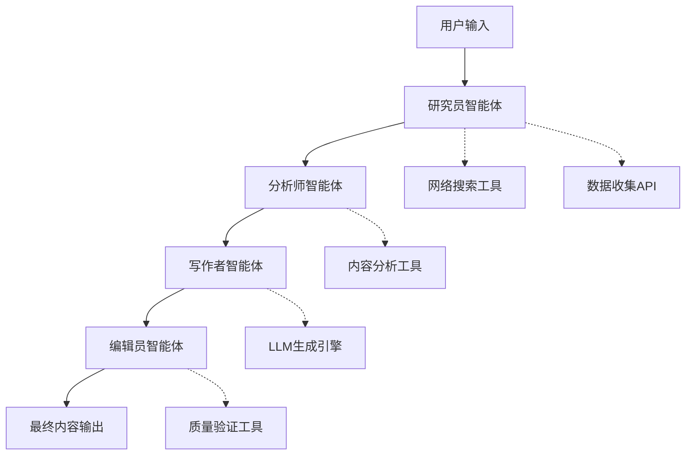

# 🚀 CrewAI-ContentStudio

基于CrewAI多智能体协作的AI内容创作平台，通过专业化的研究、分析、写作和编辑智能体，实现完整的内容创作工作流自动化。

[](https://www.python.org/downloads/)
[](https://github.com/joaomdmoura/crewAI)
[](https://opensource.org/licenses/MIT)
[](https://streamlit.io/)

## ✨ 核心功能

- 🔍 **自动化研究**：多源实时数据收集和信息验证
- 📊 **智能分析**：AI驱动的内容规划和趋势识别
- ✍️ **高质量写作**：多格式专业内容生成
- 📝 **智能编辑**：自动校对、事实核查和SEO优化
- 🎯 **多格式支持**：博客文章、技术报告、营销文案等
- 🌐 **Streamlit界面**：用户友好的Web交互界面
- 🔄 **协作工作流**：模拟真实内容团队的多智能体系统

## 🏗️ 多智能体架构



### 智能体角色

| 智能体 | 角色定位 | 核心职责 |
|-------|---------|----------|
| 🔍 **研究员** | 内容研究专家 | 收集最新信息、识别趋势、验证信息源 |
| 📊 **分析师** | 内容策略分析师 | 数据分析、提取洞察、创建内容大纲 |
| ✍️ **写作者** | 专业内容创作者 | 基于研究生成原创、有吸引力的内容 |
| 📝 **编辑员** | 质量保证专家 | 校对编辑、事实核查、SEO和可读性优化 |

## 🛠️ 技术栈

- **核心框架**: [CrewAI](https://github.com/joaomdmoura/crewAI) - 多智能体编排
- **大语言模型**: OpenAI GPT-4 / GPT-4 Turbo
- **前端界面**: Streamlit - 交互式Web界面
- **工具集成**: LangChain、SerperDev（网络搜索）、BeautifulSoup
- **开发语言**: Python 3.10+
- **配置管理**: 基于YAML的智能体和任务定义

## 🚀 快速开始

### 环境要求

- Python 3.10 或更高版本
- OpenAI API密钥
- 稳定的网络连接（用于网络搜索功能）

### 1. 克隆项目

```bash
git clone https://github.com/your-username/CrewAI-ContentStudio.git
cd CrewAI-ContentStudio
```

### 2. 环境搭建

```bash
# 创建虚拟环境
python -m venv venv

# 激活虚拟环境
# Windows:
venv\Scripts\activate
# macOS/Linux:
source venv/bin/activate

# 安装依赖
pip install -r requirements.txt
```

### 3. API配置

在项目根目录创建 `.env` 文件：

```env
# 必需：OpenAI API密钥
OPENAI_API_KEY=sk-your-openai-api-key-here

# 可选：网络搜索API（增强研究功能）
SERPER_API_KEY=your-serper-api-key-here

# 模型配置
DEFAULT_MODEL=gpt-4
TEMPERATURE=0.7

# 应用设置
APP_NAME=CrewAI ContentStudio
DEBUG=True
```

### 4. 基础测试

```bash
# 测试基础功能
python test_basic.py
```

预期输出：
```
🎯 CrewAI-ContentStudio 基础测试
✅ API密钥配置正确
✅ Agent和Crew创建成功
🎉 测试成功完成！
```

### 5. 启动应用

```bash
# 启动Streamlit Web界面
streamlit run src/ui/streamlit_app.py
```

在浏览器中打开 `http://localhost:8501`

## 📁 项目结构

```
CrewAI-ContentStudio/
├── README.md                   # 项目文档
├── requirements.txt            # Python依赖
├── .env.example               # 环境变量模板
├── .gitignore                 # Git忽略规则
├── test_basic.py              # 基础功能测试
│
├── src/                       # 源代码
│   ├── __init__.py
│   ├── config/                # 配置文件
│   │   ├── agents.yaml        # 智能体定义
│   │   ├── tasks.yaml         # 任务配置
│   │   └── settings.py        # 应用设置
│   │
│   ├── agents/                # 智能体实现
│   │   ├── researcher.py      # 研究员智能体
│   │   ├── analyst.py         # 分析师智能体
│   │   ├── writer.py          # 写作者智能体
│   │   └── editor.py          # 编辑员智能体
│   │
│   ├── tools/                 # 自定义工具
│   │   ├── search_tools.py    # 网络搜索功能
│   │   ├── content_tools.py   # 内容处理工具
│   │   ├── file_tools.py      # 文件操作工具
│   │   └── validation_tools.py # 质量验证工具
│   │
│   ├── crew/                  # Crew编排
│   │   └── content_crew.py    # 主要Crew实现
│   │
│   ├── ui/                    # 用户界面
│   │   ├── streamlit_app.py   # 主Streamlit应用
│   │   └── components/        # UI组件
│   │
│   └── utils/                 # 工具函数
│       ├── logger.py          # 日志配置
│       └── helpers.py         # 辅助函数
│
├── tests/                     # 测试套件
│   ├── test_agents.py         # 智能体测试
│   ├── test_tools.py          # 工具测试
│   └── test_integration.py    # 集成测试
│
├── data/                      # 数据目录
│   ├── templates/             # 内容模板
│   ├── outputs/               # 生成内容
│   └── cache/                 # 缓存文件
│
├── docs/                      # 文档
│   ├── API.md                 # API文档
│   ├── DEPLOYMENT.md          # 部署指南
│   └── DEVELOPMENT.md         # 开发指南
│
└── scripts/                   # 实用脚本
    ├── setup.sh               # 环境设置
    └── deploy.sh              # 部署脚本
```

## 📋 开发路线图

### 第一周：核心实现

#### Day 1-2：基础搭建 ✅
- [x] 环境搭建和依赖安装
- [x] 基础项目结构
- [x] API配置和测试
- [x] 简单智能体创建和验证

#### Day 3-4：多智能体系统 🔄
- [ ] 实现四个专业化智能体
- [ ] 创建YAML配置文件
- [ ] 开发Crew编排逻辑
- [ ] 添加错误处理和重试机制

#### Day 5-6：用户界面 📋
- [ ] 构建Streamlit Web界面
- [ ] 创建输入表单和结果展示
- [ ] 添加实时进度跟踪
- [ ] 实现下载和分享功能

#### Day 7：测试与文档 📝
- [ ] 编写全面的测试用例
- [ ] 性能优化
- [ ] 完善文档
- [ ] 部署准备

### 未来增强功能

#### 第二阶段：高级功能（第2-3周）
- [ ] 内容模板和预设
- [ ] 批处理功能
- [ ] 用户认证系统
- [ ] 内容历史和版本管理

#### 第三阶段：企业级功能（第2个月）
- [ ] API端点开发
- [ ] 团队协作功能
- [ ] 高级分析仪表板
- [ ] 自定义模型集成

## 🎯 使用示例

### 基础内容创作

```python
from src.crew.content_crew import ContentCrew

# 初始化Crew
crew = ContentCrew()

# 创建内容
result = crew.create_content(
    topic="2025年AI发展趋势",
    content_type="blog_post",
    target_audience="技术专业人士",
    word_count=1000
)

print(result)
```

### Streamlit界面操作

1. **主题输入**：输入您的内容主题和要求
2. **配置设置**：选择内容类型、目标受众和风格
3. **内容生成**：实时观看智能体协作过程
4. **结果查看**：编辑和下载最终内容

### 支持的内容类型

- 📝 **博客文章**：带SEO优化的吸引人文章
- 📊 **技术报告**：数据驱动的分析和见解
- 📢 **营销文案**：具有说服力的销售和推广内容
- 📰 **新闻文章**：时事和趋势分析
- 🎓 **教育内容**：教程和操作指南

## 🧪 测试

### 运行所有测试

```bash
# 运行测试套件
python -m pytest tests/ -v
```

### 单独测试类别

```bash
# 测试单个组件
python -m pytest tests/test_agents.py      # 智能体功能
python -m pytest tests/test_tools.py       # 工具集成
python -m pytest tests/test_integration.py # 端到端工作流
```

### 手动测试

```bash
# 测试基础功能
python test_basic.py

# 测试单个智能体
python src/agents/researcher.py
python src/agents/writer.py
```

## 🔧 配置说明

### 智能体配置（agents.yaml）

```yaml
researcher:
  role: "内容研究专家"
  goal: "收集关于{topic}的全面、准确信息"
  backstory: "拥有多个数据源访问权限的专业研究员"
  tools:
    - SerperDevTool
    - WebsiteSearchTool

writer:
  role: "专业内容创作者" 
  goal: "创建关于{topic}的有吸引力的{content_type}"
  backstory: "专精{content_type}的经验丰富写作者"
```

### 任务配置（tasks.yaml）

```yaml
research_task:
  description: "深入研究{topic}并收集相关信息"
  expected_output: "包含信息源的全面研究报告"
  
writing_task:
  description: "基于研究结果创建{content_type}"
  expected_output: "可发布的精装{content_type}"
```

## 🚨 故障排除

### 常见问题

#### API密钥错误
```bash
❌ 错误：未找到OpenAI API密钥
✅ 解决：检查.env文件和API密钥格式
```

#### 导入错误
```bash
❌ 错误：ModuleNotFoundError: No module named 'crewai'
✅ 解决：激活虚拟环境并重新安装依赖
```

#### 性能问题
```bash
❌ 错误：智能体响应超时
✅ 解决：检查网络连接和API配额
```

### 调试模式

启用详细日志记录：

```python
import logging
logging.basicConfig(level=logging.DEBUG)
```

### API使用监控

检查您的OpenAI使用情况：
- 访问 [OpenAI使用仪表板](https://platform.openai.com/usage)
- 监控token消耗和成本
- 设置使用警报

## 📊 性能指标

### 预期性能
- **研究阶段**：30-60秒
- **分析阶段**：15-30秒  
- **写作阶段**：45-90秒
- **编辑阶段**：20-40秒
- **总耗时**：每篇文章2-4分钟

### 成本估算
- **GPT-4**：每篇文章约￥0.7-2.1元
- **GPT-4 Turbo**：每篇文章约￥0.35-1.05元
- **日常预算**：开发/测试期间￥35-70元

## 🤝 贡献指南

我们欢迎贡献！请遵循以下步骤：

### 开发环境设置

```bash
# Fork仓库
# 克隆您的fork
git clone https://github.com/your-username/CrewAI-ContentStudio.git

# 创建功能分支
git checkout -b feature/your-feature-name

# 进行更改并测试
python -m pytest tests/

# 提交拉取请求
```

### 贡献准则

1. **代码风格**：遵循PEP 8并使用类型提示
2. **测试**：为新功能添加测试
3. **文档**：更新README和文档字符串
4. **提交**：使用清晰、描述性的提交信息

### 贡献领域

- 🔧 **工具开发**：新的数据源和API
- 🎨 **UI改进**：增强Streamlit界面
- 📊 **分析功能**：使用跟踪和性能指标
- 🌐 **国际化**：多语言支持
- 🧪 **测试**：扩大测试覆盖率

## 📄 许可证

本项目采用MIT许可证 - 详见 [LICENSE](LICENSE) 文件。

## 🙏 致谢

- [CrewAI](https://github.com/joaomdmoura/crewAI) - 多智能体框架
- [OpenAI](https://openai.com/) - GPT模型
- [Streamlit](https://streamlit.io/) - Web界面框架
- [LangChain](https://langchain.com/) - LLM编排工具

## 📞 支持与帮助

### 文档资源
- 📖 [完整文档](docs/)
- 🚀 [快速开始指南](docs/QUICKSTART.md)
- 🔧 [API参考](docs/API.md)
- 🚀 [部署指南](docs/DEPLOYMENT.md)

### 社区支持
- 💬 [GitHub讨论](https://github.com/your-username/CrewAI-ContentStudio/discussions)
- 🐛 [问题跟踪](https://github.com/your-username/CrewAI-ContentStudio/issues)
- 📧 邮箱：your-email@example.com

### 获取帮助

1. **查阅文档**：大多数问题在文档中都有答案
2. **搜索问题**：在GitHub issues中查找类似问题
3. **创建Issue**：提供问题的详细信息
4. **参与讨论**：与其他用户和贡献者交流

---

**用 ❤️ 为AI和内容创作社区而构建**

*感谢令人惊叹的开源AI生态系统*